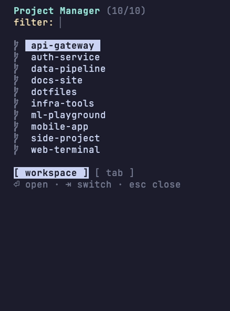

# herdr-project-manager



Project manager plugin for [herdr](https://herdr.dev) — inspired by the VSCode
[Project Manager](https://marketplace.visualstudio.com/items?itemName=alefragnani.project-manager)
extension. Keep a list of your projects (auto-discovered by glob patterns or added manually) and
jump into any of them as a new herdr **tab** or **workspace** from a fuzzy-filter picker.

## Features

- **Glob auto-discovery** — patterns like `~/sandbox/*/.git` find every repo automatically
  (a match on a `.git` directory registers its parent as the project).
- **Manual projects** — pin any directory with a custom name.
- **Always-on right dock** — the picker auto-docks itself to the right edge of every tab and
  workspace (on creation and on focus), so it's there without running any action first. A hung
  picker (pane still open, process no longer responding) is detected via a heartbeat and
  automatically replaced with a fresh one.
- **Sidebar picker** (VSCode-style names-only list): type to filter fuzzily, `↑`/`↓` to move,
  `Enter` opens with the selected mode button — `[ workspace ]` (default) or `[ tab ]`, switched
  with `Tab`/`←`/`→` (`Ctrl+W`/`Ctrl+T` open directly), `Esc` closes.
- **Toggle** — running the `Open project picker` action closes the sidebar *in the current tab*
  and snoozes auto-redock there until the action is run again in that tab; other tabs keep their
  own auto-docked picker untouched.
- **Collapse/expand in place** — click the `«`/`»` glyph in the bottom-right corner, or press `<`,
  to collapse the sidebar to a slim strip (like herdr's own sidebar); a click on the corner, or
  any key, expands it back.
- **Instant load** — the last discovery result is cached in the plugin state dir, so the list
  paints immediately and globs refresh in the background.
- **Add current directory** action — one keypress to track the project you're standing in.
- Zero npm dependencies; plain Node.js (>= 22).

## Install

```bash
herdr plugin install barnuri/herdr-project-manager
```

Or for local development:

```bash
git clone https://github.com/barnuri/herdr-project-manager
herdr plugin link ./herdr-project-manager
```

## Usage

| What | How |
|---|---|
| Nothing — the sidebar docks itself | Auto-appears on the right edge of every new/focused tab and workspace. No action needed. |
| Close it in this tab / bring it back | Run the `Open project picker` action (toggles: closes + snoozes this tab, or opens + un-snoozes it), or `herdr plugin pane open --plugin barnuri.project-manager --entrypoint picker` |
| Collapse to a strip / expand | Click the `«`/`»` corner glyph, or press `<` |
| Add current directory | Run the `Add current directory as project` action |
| Edit the project list | Run the `Edit project list` action (opens the config in `$EDITOR` in a new tab) |

Bind the picker to a key in your herdr `config.toml`:

```toml
[[keys.command]]
key = "prefix+shift+p"
type = "plugin_action"
command = "barnuri.project-manager.open-picker"
description = "open project picker"
```

(`prefix+p` and `prefix+g` are herdr defaults — `previous_tab` and `goto` — so pick a free
combination like `prefix+shift+p`; check yours with `prefix+?`.)

## Configuration

The config lives in the plugin's config directory (`herdr plugin config-dir barnuri.project-manager`),
in `projects.json`. Create it in one line:

```bash
echo '{ "globs": ["~/sandbox/*/.git"], "projects": [] }' > "$(herdr plugin config-dir barnuri.project-manager)/projects.json"
```

Full shape:

```json
{
    "globs": ["~/sandbox/*/.git", "~/work/**/.git"],
    "projects": [
        { "name": "dotfiles", "path": "~/.dotfiles" }
    ]
}
```

- `globs` — patterns expanded on every picker launch; `~` is expanded; a `.git` match registers
  its parent directory.
- `projects` — manual entries; they win over discovered entries on the same path.

## Development

```bash
npm test          # node --test tests/
herdr plugin link .
```

## Publishing note

The herdr marketplace indexes public GitHub repos carrying the `herdr-plugin` topic — add that
topic to the repo to make the plugin discoverable.

## License

MIT
